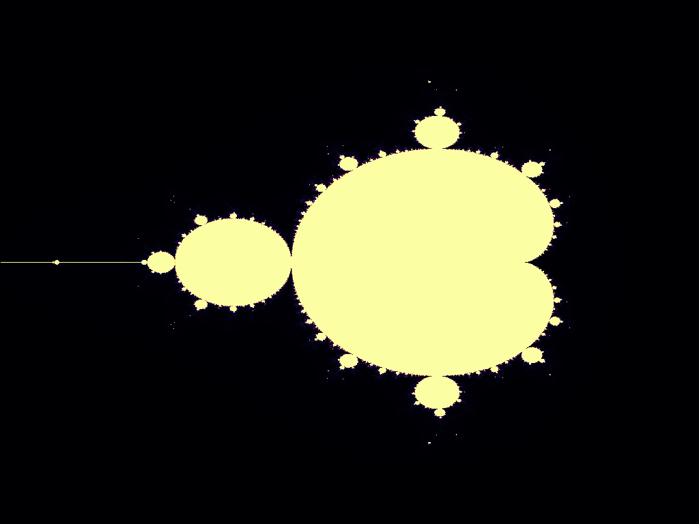
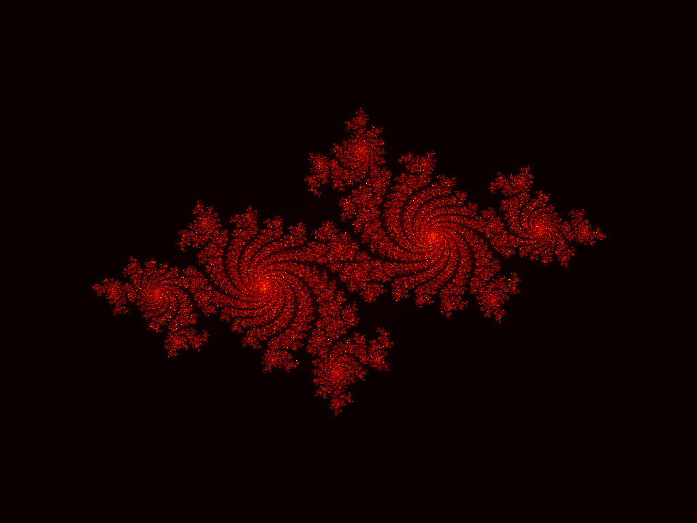

## Visualizing the Mandelbrot and Julia sets on GPU

This is a simple example of how to visualize the Mandelbrot and Julia sets using the GPU. The code is written in Python and uses the PyTorch library to interface with the GPU. The code is based on the example provided in the book "Python Parallel Programming Cookbook" by Giancarlo Zaccone.

Main inspiration for this code comes from the book "Python Parallel Programming Cookbook" by Giancarlo Zaccone. The code is based on the example provided by Jeremy Howard in his YouTube tutorial on CUDA programming. ChatGPT was a collaborator on this project. 

## Examples

| Mandelbrot Set | Julia Set |
| --- | --- |
|  |  |
